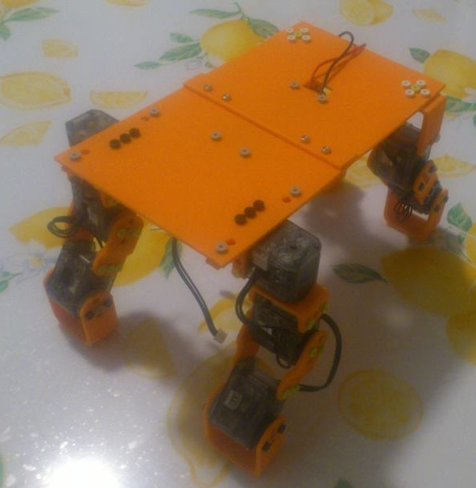

Gaspard
=======

Gaspard is sheep robot created to compete in *RobotsWar*, a contest launched
by *Robot Campus*: http://www.robotcampus.fr/robots-war/

This repository contains the source code of Gaspard's program.

Setup
-----

This project uses a framework provided by *Robot Campus*. You can get it by
cloning the proper repository:

`git clone https://github.com/RobotsWar/RobotsWar.git`

Go into the created directory and clone this repository:

`cd RobotsWar && git clone https://github.com/shazame/Gaspard.git`

That's it, now you can `cd Gaspard` and go to the compilation phase.

Compilation
-----------

- Update the first line of `build-targets.mk` if you want to add some files
- Run `make` to compile
- Run `make install` to flash your board
